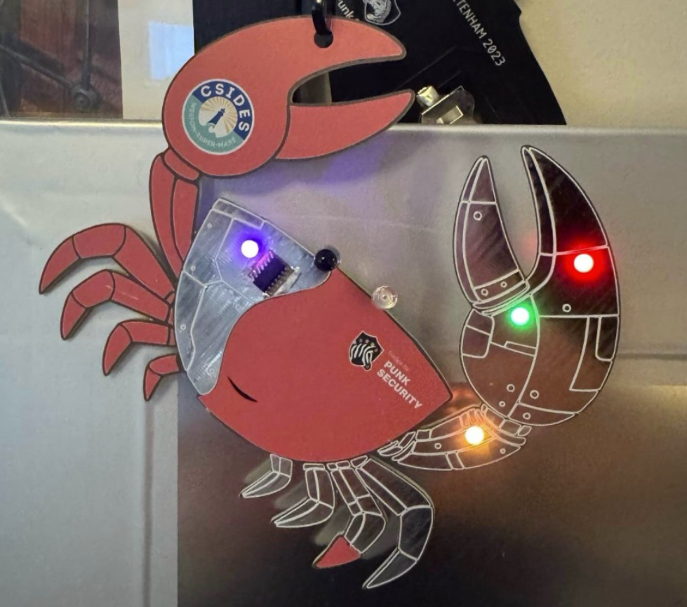
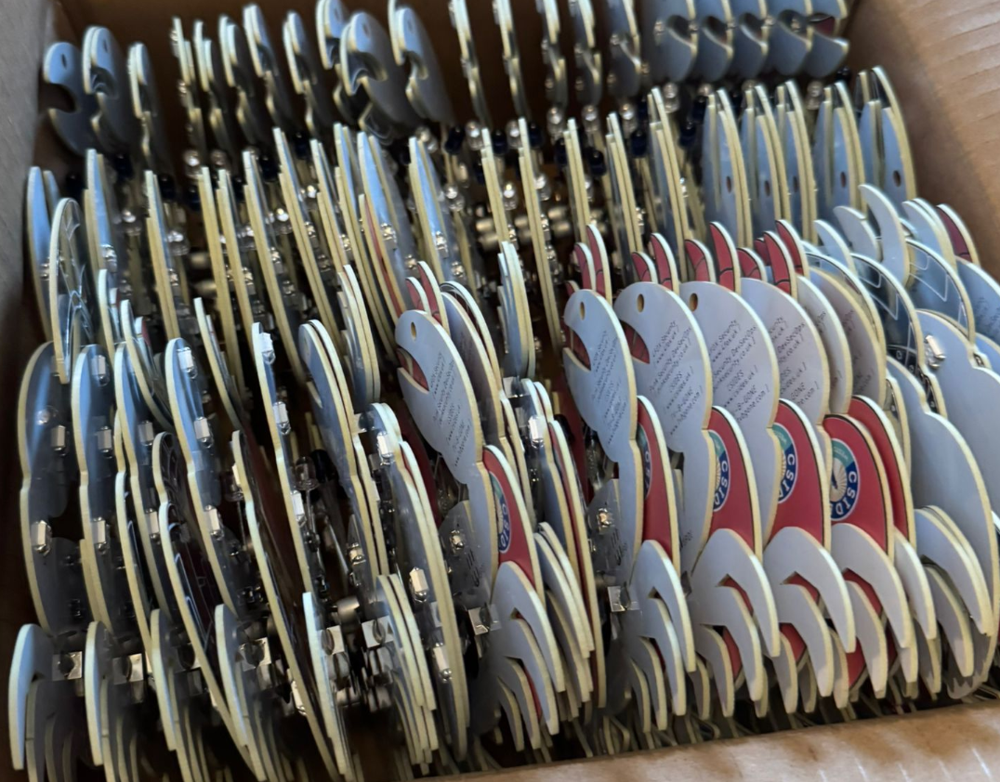
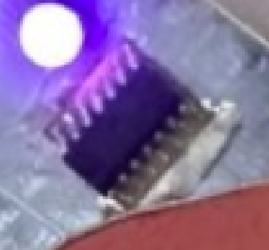

# This is the repo for the CSIDES 2025 crab badge

**This badge is a litle bit funky as we ported the TV-B-GONE code to this badge so you cna use it to turn off most TVs**

This is our most complex badge to date, with quite a few extra components. Soldering it is not easy.

The badge is printed with full-colour UV printed silkscreen. Usually we use JLCPCB for this (and to be honest they're quality is better in our opinion) but they cant print full-colour onto a HASL (silver) finished board. They can only do it with ENIG, which is the gold look. As this crab is meant to be a cyborg, we had to go with PCBWAY this time. 

As with other badges, we made the first design in AutoCAD EAGLE. It's just easy to use, and we're really familiar with it. Then we export it as a gerber and include the silkscreen file manually. This is then provided to PCBWAY. That gerber is in this repo, so you can skip all that.

### TV-B-GONE

For a long time, we've wanted to do a badge which can turn TVs off. A cybord crab, with it's little eye stalk things seemed like our perfect opportunity. It took a lot of work to get the code to work, and tweak the circuitry to get a good range.

Go check out the original code - https://github.com/shirriff/Arduino-TV-B-Gone  
... and the main website- https://www.tvbgone.com/  
... and this instructables - https://www.instructables.com/4-DIY-TV-B-Gone/  
... and this one - https://www.instructables.com/350-DIY-TV-B-Gone-Mico/

We really stood on the shoulders of giants with this, and hopefully added a new and interesting twist. The range is pretty good thanks to a capacitor, which is loosely optimised through trial and error. Essentially you want it to charge as as quickly as possible to not impact the microcontroller, but not discharge completely during a signal transmission. Also size / cost etc.

The badge has a potentiometer so you can control the resistance to the LEDs, and therefore limit their current draw. On fresh batteries, you can go full power and get 20-25m of range. As the batteries run low, the badge will keep crashing as you try to transmit so just tweak the pot.

Lots of things in this repo:

- EAGLE.brd: The AutoCAD Eagle board design
- EAGLE.sch: The AutoCAD Eagle circuit schematic
- gerber.zip: the file you can upload to JLCPCB and order your own badge, as is
- SILK_TOP.png: the full colour silkscreen print
- firmware.ino: the arduino code that powers the badge, which you can modify and flash via the SAO connector
- main.h: This is part of the TV-B-GONE code we ported
- WORLD_IR_CODES.h: More of the TV-B-GONE code

## Bill Of Materials

There are a lot of components with this badge. It started out on a breadboard and we tried to keep the part count as low as possible whilst making it actually work! The transistors are a right pain to solder!

This is our first badge using a 1614 microcontroller too. We couldn't fit the code onto the usual ATTINY412.

Essentially its:

* ATTINY1614 microcontroller
* Button - any surface mount button fitting the footprint will work
* NC Button - The reset button it the same footprint as the usual button, but is "open" when pressed. You can skip this and just solder the pads together if you prefer.
* CR2032 battery clip x 2 - surface mount not through hole
* Neopixel 5050 addressable LED - Definitely get the right version of these
* 100 Ohm Trimmer - TC33X-2-101E
* Aishi 100uF Cap - EMK0JM101E83D00R
* NPN transistor SOT-23 - MMBT3904
* 940nm IR LEDS - We had 2 different ones - 10 degree and 40 degree transmission beams

## How does it work?

The badge does the usually blinky modes, but also turns TV off.

To cycle flashy modes, you just short press the button on the badge. 

It can also turn TVs off. To do this, hold the button in for around 3 or 4 seconds and then loose. The badge will start flashing green in one LED. Every LED flash is another European TV off code. When its run out of codes, it will start flashing blue. These are the US codes. When its run out of those, it will return to normally flashy mode. You can exit early at any point by simply pressing the button again.

Holding the button in for a long time will cause the badge to go to sleep. It will do this itself after 60 mins-ish.

## Ordering your own badge

We've uploaded the AutoCAD EAGLE schematic and board design!  You will probably have to do some tweaks to get it working as they're not designed to be standalone exports.

We've also uploaded the gerber.zip.  Take this to PCBWAY and you can order your own exact copies of the board :)

## Writing and flashing code!

We use [MegaTinyCore](https://github.com/SpenceKonde/megaTinyCore) for the arduino interface.

Dev and flashing is done within the Arduino IDE ( < v2 ) using a jtag2updi interface, as discussed [here](https://github.com/SpenceKonde/AVR-Guidance/blob/master/UPDI/jtag2updi.md)

We use [these little usb sticks](https://amzn.eu/d/c0lx0wG), with a 4.7k resistor soldered between the Tx and Rx lines.  

### Installing MegaTinyCore dependencies

This board package can be installed via the board manager in arduino. The boards manager URL is:

`http://drazzy.com/package_drazzy.com_index.json`

1. File -> Preferences, enter the above URL in "Additional Boards Manager URLs"
2. Tools -> Boards -> Boards Manager...
3. Wait while the list loads (takes longer than one would expect, and refreshes several times).
4. Select "megaTinyCore by Spence Konde" and click "Install". For best results, choose the most recent version.

### Setting up the IDE

1. Open the file **firmware.ino** in arduino
2. Select tools > Board > megaTinyCore > ATtiny412/402/212/202
3. Select tools > Chip > ATtiny412
4. Select tools > Clock > 16Mhz internal *(it wont turn off TVs otherwise)*
5. Select tools > Programmer > SerialUPDI SLOW
6. Select tools > Port > ( pick your COM port)

### Flashing firmware
1. Connect the 3v3 pin to 3v on your usb (maybe wedge it in the battery clip)
2. Connect GND to GND
3. Connect UPDI to the RxD port
4. Click Upload button

## How to solder?

It's super tricky!

Essentially, line up the parts and solder them.

We placed the ATTINY1614 on the front as it looked quite cool. It's horrible to solder. Line up the micontroller dimple with the circle, and try not to bridge the pins with the crabs metal background. 

The back is also tricky. Most parts are obvious. The RST button should be a normally closed button, or just solder a bit of wire in its place. The triangles near the LED placements show you how to rotate the LEDs into position.
